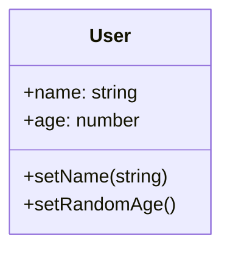

## Web Framework with TypeScript

### Git branches:
- main: latest
- mega-user: one class with all the methods
- composition: refactor using composition pattern
- reusable: refactor to not limited to User class

### Requirements diagrams
- General Requirements:
    - need to create a class to represent a User and its data, name and age;
    - User class needs to have the ability to store some data, retrieve it and change it;
    - needs to have the ability to notify the rest of the app when some data is changed, reactivity;
    - User needs to be able to persist data to an outside server, and then retrieve it at some future point
- Extraction-Approach:
    - build class User as a 'mega' class with tons of methods
    - refactor User to use composition
    - refactor User to be a reusable class that can represent any piece of data, not just User
### Structures
- Model Classes:
  - Handle data;
  - Represent Users;
  - Blog Posts;
  - Images,
  - etc.
- View Classes:
  - Handle HTML;
  - Handle Events;

### Class diagram

