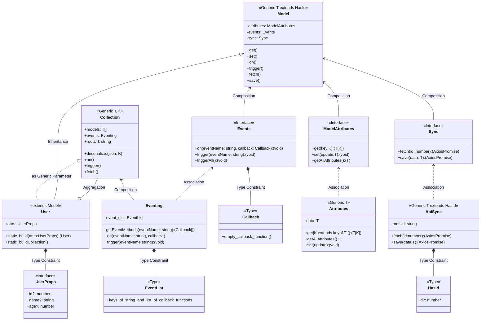

## Web Framework with TypeScript

### Execution:
- run on browser: `npm run web`
### Installation
- run on browser: Parcel bundler
  - install parcel2 with npm at global level `npm install parcel -g`
  - Run project to browser: `parcel -p <port_number> index.html`
  - install local backend server JSON server: `npm install --save-dev json-server`
    - create `db.json` in root directory:
    ```json
    {
        "users": []
    }
    ```
    - run json server at a different terminal window at root directory:
      - `json-server -w db.json`
  - initialize npm project: `npm init`, and package.json created at root directory.
  - <a name="dependencies"></a>install necessary dependencies:
      - install node typescript support: `npm i --save-dev @types/node`
      - install concurrently: `npm i --save-dev concurrently`
      - install axios: `npm i --save-dev axios`
  - install local backend server JSON server: `npm i --save-dev json-server`
  - default port is 3000, you can allocate a different port by using `-p <port_number>`
  - in browser, got to `http://localhost:3000` to check documentation
  - in browser, got to `http://localhost:3000/users` for resource
##### Optional, and not recommended for Parcel2
- initialize typescript compiler: `tsc --init`, tsconfig.json template created in root directory.
- modify the `rootDirs` and `outDir` in `tsconfig.json`:
  - `rootDirs`: [",/src""]
  - `outDir`: "./build"

#### Note:
*Parcel bundler require `type="module"` added into the script tag at `index.html`*

### Git branches:
- main: latest
- mega-user: one class with all the methods:
    - mega-user-JSON-server: this is where we added on JSON server and use axios to persist data in db.json.
- composition-refactor: refactor using composition pattern
- reusable-inheritance: refactor to not limited to User class
- views: (where we insert the view classes)


### Structure
- Model Classes:(`/src/models/`)
    - Handle data;
    - Represent Users;
    - Blog Posts;
    - Images,
    - etc.
- View Classes:
    - Handle HTML;
    - Handle Events;
    - 
### Requirements
- General Requirements:
    - need to create a class to represent a User and its data, name and age;
    - User class needs to have the ability to store some data, retrieve it and change it;
    - needs to have the ability to notify the rest of the app when some data is changed, reactivity;
    - User needs to be able to persist data to an outside server, and then retrieve it at some future point
- Extraction-Approach:
    - build class User as a 'mega' class with tons of methods
    - refactor User to use composition
    - refactor User to be a reusable class that can represent any piece of data, not just User


#### Mega-User Class diagram

#### Composition Class Diagram


#### reusable-Inheritance


#### views

